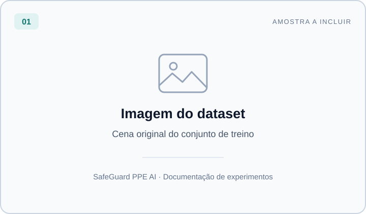
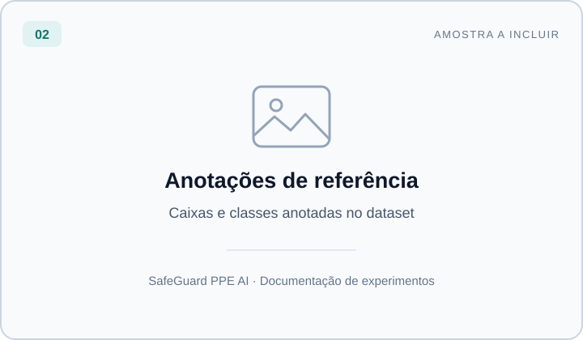
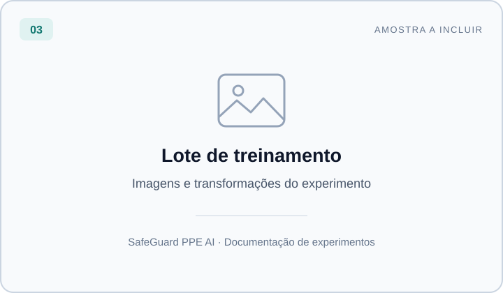
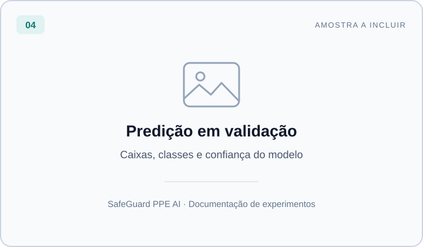

# SafeGuard PPE AI

**Detecção de capacetes, cabeças e pessoas com visão computacional.**

Projeto experimental de aprendizado de máquina para apoiar a análise visual do uso de equipamentos de proteção individual. O fluxo atual reúne preparação de dados, treinamento de um detector YOLOv8n, avaliação e uma interface Gradio para analisar imagens.

[Modelo e dados](#modelo-e-dados) · [Galeria](#galeria-de-treinamento-e-resultados) · [Resultados](#resultados-registrados) · [Instalação](#instalação) · [Execução](#execução-local) · [Roadmap](#roadmap)

## Estado do projeto

O repositório está na fase de protótipo. Os recursos abaixo estão presentes no código:

| Recurso | Implementação atual |
| --- | --- |
| Preparação do dataset | Download pelo Roboflow e criação de uma divisão de validação quando ela está vazia. |
| Treinamento | Ajuste de pesos pré-treinados do YOLOv8n para as classes do dataset. |
| Avaliação | mAP50, mAP50–95, precisão e recall no conjunto de validação. |
| Inferência em imagens | Caixas delimitadoras, classes, confiança e contagem de detecções por classe. |
| Demonstração | Upload de imagem no Gradio, ajuste de confiança e visualização das predições. |

Integração com câmeras, rastreamento de pessoas, zonas de risco, notificações e aplicativo móvel são possibilidades de evolução. O fluxo atual trabalha com imagens individuais e ainda não constitui um sistema de monitoramento em produção.

## Modelo e dados

### Qual modelo usamos?

O projeto utiliza **YOLOv8n**, a variante nano da família YOLOv8 da Ultralytics, com **PyTorch**. Trata-se de aprendizado profundo supervisionado para detecção de objetos: o modelo aprende com imagens anotadas a localizar objetos e atribuir uma classe a cada caixa.

O treinamento parte de `yolov8n.pt`, com pesos pré-treinados no COCO, e os ajusta ao dataset do projeto por transferência de aprendizado. O arquivo `best.pt` gerado pelo treinamento contém os pesos ajustados. As classes do detector dependem dos pesos carregados; o `yolov8n.pt` original não equivale ao modelo treinado para este projeto. Consulte a [documentação oficial do YOLOv8](https://docs.ultralytics.com/models/yolov8/).

### Dataset e classes

O código utiliza o [Hard Hat Workers, versão 2, no Roboflow Universe](https://universe.roboflow.com/joseph-nelson/hard-hat-workers/dataset/2), exportado no formato YOLOv8.

| Classe | Interpretação no dataset |
| --- | --- |
| `head` | Cabeça. |
| `helmet` | Capacete. |
| `person` | Pessoa. |

O experimento registrado em [Visao_segura.ipynb](Visao_segura.ipynb) usou **4.216 imagens de treino** e **1.053 de validação**, após separar parte das imagens de treino. A implementação atual seleciona os primeiros arquivos retornados pela listagem para essa separação, sem embaralhamento explícito ou estratificação. Essa limitação deve ser revista em novos experimentos.

A detecção de uma cabeça ou de um capacete, isoladamente, não determina o uso correto do EPI. Essa conclusão requer regras de associação entre objetos e validação no contexto de aplicação. Máscaras, coletes e outros EPIs não fazem parte das três classes deste treinamento.

## Galeria de treinamento e resultados

Espaço reservado para documentar visualmente os experimentos. **Os quadros abaixo são marcadores de posição; nenhuma amostra real foi adicionada ainda.**

| Imagem do dataset | Anotações de referência |
| :---: | :---: |
|  |  |
| Exemplo de cena usada no treinamento. | A mesma cena com as caixas e classes anotadas. |

| Lote de treinamento | Predição em validação |
| :---: | :---: |
|  |  |
| Visualização de um lote e das transformações aplicadas. | Imagem de validação com as predições do modelo. |

Para preencher a galeria, adicione os arquivos em [`docs/images/`](docs/images/README.md) e substitua os caminhos `.svg` acima pelos arquivos correspondentes. O diretório aceita imagens JPG, JPEG, PNG e WebP no Git. Registre na legenda a origem, o conjunto (treino ou validação), o experimento e, para predições, o limiar de confiança. As instruções e os nomes sugeridos estão no [guia da galeria](docs/images/README.md).

## Resultados registrados

Os valores abaixo foram extraídos da **saída de validação salva no notebook**, em uma execução anterior no Google Colab. Eles não representam uma nova medição no ambiente local nem uma avaliação independente em produção.

| Condição do experimento | Valor registrado |
| --- | --- |
| Modelo | YOLOv8n ajustado para 3 classes |
| Treinamento | 20 épocas, `imgsz=640`, lote de 64 |
| Hardware | NVIDIA A100-SXM4 com 40 GB |
| Ambiente | Python 3.12.12, PyTorch 2.8.0+cu126, Ultralytics 8.3.213 |
| Validação | 1.053 imagens e 4.136 instâncias anotadas |

| Métrica de validação | Resultado |
| --- | ---: |
| mAP50 | 65,2% |
| mAP50–95 | 45,5% |
| Precisão média | 96,1% |
| Recall médio | 61,5% |

**Resultados por classe:**

| Classe | Instâncias | Precisão | Recall | mAP50 |
| --- | ---: | ---: | ---: | ---: |
| `head` | 995 | 93,2% | 91,5% | 95,3% |
| `helmet` | 3.048 | 95,3% | 93,0% | 97,7% |
| `person` | 93 | 100,0% | 0,0% | 2,75% |

A classe `person` apresentou recall zero nessa avaliação. O valor de precisão exibido para ela deve ser interpretado junto desse resultado e do mAP muito baixo; ele não demonstra boa capacidade de detectar pessoas. Melhorar a avaliação dessa classe é uma prioridade. Também não há um benchmark reproduzível de FPS da aplicação completa documentado no repositório.

## Instalação

Use **Python 3.12** como referência para o ambiente local. As dependências estão em [requirements.txt](requirements.txt); o arquivo usa intervalos de versões, portanto instalações feitas em momentos diferentes podem produzir ambientes distintos.

```bash
git clone https://github.com/ricardofrugoni/safeguard-ppe.ai.git
cd safeguard-ppe.ai
python -m venv .venv
```

Ative o ambiente no Windows / PowerShell:

```powershell
.\.venv\Scripts\Activate.ps1
```

Ou no Linux / macOS:

```bash
source .venv/bin/activate
```

Instale as dependências:

```bash
python -m pip install --upgrade pip
python -m pip install -r requirements.txt
```

Para executar o notebook, instale também `ipykernel` e selecione o Python da `.venv` como kernel no editor:

```bash
python -m pip install ipykernel
```

O treinamento pode ser executado em CPU. Para usar uma GPU NVIDIA, siga o [seletor oficial de instalação do PyTorch](https://pytorch.org/get-started/locally/) e verifique a disponibilidade de CUDA no mesmo ambiente usado pelo notebook:

```bash
python -c "import torch; print(torch.__version__); print(torch.cuda.is_available())"
```

## Execução local

### Configuração e treinamento

Os valores padrão de [src/config.py](src/config.py) ainda refletem o experimento no Colab: caminhos em `/content`, `device=0`, lote de 64 e cache em RAM. Para executar localmente, forneça uma configuração adequada ao computador.

O exemplo abaixo usa diretórios dentro do projeto, seleciona CPU quando CUDA está indisponível e utiliza lotes menores. Salve-o como `executar_local.py` na raiz do repositório. Esse arquivo é um exemplo a criar, não um script já incluído.

```python
import os
from pathlib import Path

import torch

from src.app import PPEDetectionApp
from src.config import AppConfig


def main():
    root = Path(__file__).resolve().parent
    config = AppConfig()
    config.save_dir = str(root / "runs")
    config.dataset.base_path = str(root / "datasets" / "ppe")
    config.dataset.augmented_path = str(root / "datasets" / "ppe_augmented")
    config.dataset.api_key = os.environ.get("ROBOFLOW_API_KEY", "")
    config.model.device = 0 if torch.cuda.is_available() else "cpu"
    config.model.batch_size = 8 if torch.cuda.is_available() else 4
    config.model.workers = 0
    config.model.cache = False

    if not config.dataset.train_images_path.exists() and not config.dataset.api_key:
        raise RuntimeError("Defina ROBOFLOW_API_KEY para baixar o dataset.")

    app = PPEDetectionApp(config)
    app.setup_dataset()
    app.train_model()
    app.load_trained_model()
    app.validate_model()
    print(f"Pesos salvos em: {config.best_model_path}")


if __name__ == "__main__":
    main()
```

Se o dataset ainda não estiver disponível no caminho configurado, defina sua chave Roboflow antes de executar. **A leitura dessa variável é feita pelo exemplo acima; os scripts originais não a carregam automaticamente.**

```powershell
# Windows / PowerShell
$env:ROBOFLOW_API_KEY = "SUA_CHAVE_ROBOFLOW"
python executar_local.py
```

```bash
# Linux / macOS
export ROBOFLOW_API_KEY="SUA_CHAVE_ROBOFLOW"
python executar_local.py
```

Se você já baixou o dataset em outro local, ajuste `config.dataset.base_path` para reaproveitá-lo. O exemplo salva os pesos em `runs/ppe_model/weights/best.pt`. O arquivo inicial `yolov8n.pt` pode ser baixado automaticamente pela Ultralytics; os pesos ajustados e o dataset não são distribuídos pelo Git.

### Demonstração com pesos treinados

Depois do treinamento, execute o trecho abaixo na raiz do projeto, em um script ou notebook. Ele carrega o `best.pt` produzido pelo exemplo anterior e abre o Gradio sem solicitar um link público:

```python
from src.app import PPEDetectionApp
from src.config import AppConfig

config = AppConfig(save_dir="runs")
config.dataset.base_path = "datasets/ppe"
app = PPEDetectionApp(config)
app.load_trained_model("runs/ppe_model/weights/best.pt")
app.launch_interface(share=False)
```

Acesse `http://localhost:7860`, carregue uma imagem e ajuste o limiar de confiança. A interface retorna a imagem anotada e as estatísticas por classe. Por padrão, o servidor usa `0.0.0.0`; `share=False` desativa o túnel público do Gradio, mas não restringe o servidor ao endereço de loopback.

### Scripts existentes e notebook

| Entrada | Comportamento |
| --- | --- |
| `python train.py` | Prepara o dataset, treina e valida usando os padrões de `AppConfig`. |
| `python demo.py` | Carrega o modelo no caminho padrão e abre o Gradio com `share=True`. |
| `python main.py --no-ui` | Executa preparação, treinamento, validação e uma inferência de exemplo. |
| `python main.py --skip-training --no-ui` | Prepara o dataset, carrega os pesos existentes e avalia. |
| `python main.py --validate-only --model-path CAMINHO/best.pt` | Avalia os pesos indicados usando o dataset configurado. |
| [Visao_segura.ipynb](Visao_segura.ipynb) | Fluxo interativo de instalação, preparação, treinamento, avaliação e demonstração. |

Antes de usar esses scripts diretamente, ajuste `AppConfig` em `src/config.py`, incluindo os caminhos, o dispositivo e a credencial de download. No notebook, essas configurações são definidas nas próprias células. As saídas antigas do Colab não indicam que o treinamento foi executado na sessão atual.

**Limitações atuais da CLI:** `--config` e `--no-share` são aceitos pelo parser de `main.py`, mas ainda não são aplicados ao fluxo. `--model-path` é utilizado no modo `--validate-only`. Para configurar a execução e o compartilhamento de forma explícita, use os exemplos Python acima.

## Estrutura do repositório

```text
.
├── Visao_segura.ipynb       # Experimento e saídas registradas
├── main.py                 # Entrada do fluxo completo
├── train.py                # Treinamento e validação
├── demo.py                 # Demonstração Gradio
├── requirements.txt        # Dependências
├── src/
│   ├── app.py              # Orquestração do fluxo
│   ├── config.py           # Configurações
│   ├── dataset_manager.py  # Download e divisão do dataset
│   ├── detector.py         # Treinamento, inferência e avaliação
│   ├── gradio_interface.py # Interface de imagens
│   └── visualizer.py       # Anotações e resumos visuais
├── tests/                  # Testes de configuração e resultados
└── docs/images/            # Galeria e instruções para incluir imagens
```

## Desenvolvimento

Os testes existentes cobrem configurações e estruturas de resultados. Eles não substituem a avaliação do detector em imagens reais.

```bash
python -m pip install pytest
python -m pytest tests/
```

Para contribuir, descreva o problema, mantenha as alterações focadas e registre a validação realizada no pull request. Novos resultados de treinamento devem incluir a versão do dataset, a divisão dos dados, os parâmetros, o ambiente e as métricas por classe. Inclua exemplos de falhas junto dos acertos na galeria.

## Roadmap

- [ ] Padronizar a configuração entre notebook e scripts e concluir as opções da CLI.
- [ ] Remover credenciais fixas do código e centralizar a configuração de download.
- [ ] Tornar a divisão de dados reproduzível e documentar uma avaliação em conjunto de teste separado.
- [ ] Investigar o baixo desempenho de `person` e ampliar a análise de erros.
- [ ] Publicar amostras anotadas, predições e curvas dos experimentos na galeria.
- [ ] Medir latência e uso de memória no hardware de destino.
- [ ] Avaliar a inclusão de novos EPIs, processamento de vídeo e câmeras.
- [ ] Projetar regras de associação, zonas de risco e alertas após validar o detector.

## Licença e autoria

O repositório contém uma [licença MIT](LICENSE) para o código do projeto. Bibliotecas, pesos e datasets têm seus próprios termos de uso; consulte também a [documentação de licenciamento da Ultralytics](https://docs.ultralytics.com/models/yolov8/#citations-and-acknowledgments) e a página do dataset.

Desenvolvido por **Ricardo Frugoni**. Sugestões e relatos de problemas podem ser registrados nas [issues do repositório](https://github.com/ricardofrugoni/safeguard-ppe.ai/issues).
